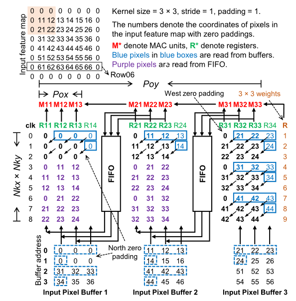
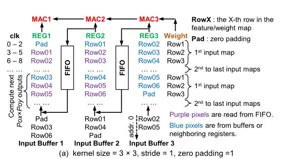
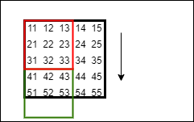
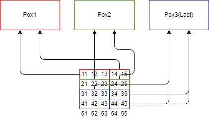

# BUF2PE数据流介绍

## 任务描述

给定Pox与Poy, 在$Pox \times Poy \times input\_channel$时钟周期内BUFPE并行计算输入矩阵中$Pox \times Poy$ 个像素的卷积结果. 其计算范围是图中($Pox = Poy = 3$)所示**以红色框内格子为左上角, 卷积核大小的各个矩阵**, 所需数据范围为图中黑框内所有数字, 即范围为$Pox + kernel\_size -1$. 完成该范围计算后, **将范围转移至绿色方框进行新的计算**. 在此期间电路不会复用之前的数据, 需要重新输入.
## 模块定义(暂定)

* Poy: 图中整个电路.
  * Weight
* Pox: 图中Pox标注所划范围内的电路.
  * FIFO
* PE: Pox下各列的电路.
* MAC: 红色部分电路.
* 
## 接口定义(暂定)

* 输入:
  * activation:
    * 
    * `activation[Pox-1:0][Poy-1:0]` 
      * 对于前$Poy-1$:
        * 启动时分别输入从计算范围内第0行至Poy-2行内, 长度等于$kernel\_size$的数据.
        * 之后数据不更新.
      * 对于最后一个序数:
        * 启动时类推前述规则, 输入最后一行的数据.
        * 之后**每`kernel_size`周期**更新为下一行的数据.
    * `activation_standby[Poy-1:0]`
      * 规则类似`activation[Pox-1:0][Poy-1:0]`.
      * 输入$kernel\_size-1$列后的数据, **每周期更新到下一列**.
  * `weight[kernel_size-1][kernel_size-1]`
    * 按自上到下, 自左到右的顺序遍历卷积核的当前处理通道. 每周期更新.

## 运算流程

1. 初始化(0-2)周期
   * PE: 各个Pox从Buffer读取前述范围数据. 第0周期读入并寄存$kernel\_size$个像素, 之后移位旧数据, 从standby读取新数据.
   * Weight: 每周期更新.
   * MAC: 读入数据和权值相乘并累加.
   * FIFO: 另存入Pox下各PE的寄存器数据.
2. 数据复用(3-8)周期
   * PE: 除最后一个Pox继续从Buffer读取数据, 各个PE从后一个Pox的FIFO中读取数据. 