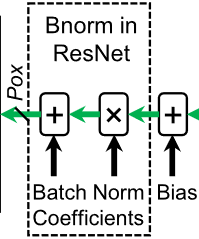

# PostProcess



Post process includes adding bias and applying batch norm.
$$
\begin{aligned}
x' &= x + b \\
x'' &= \gamma\cdot\frac{\mathrm{ReLU}(x')-\Epsilon[x]}{\sqrt{\mathrm{Var}[x]+\epsilon}}+\beta\\
\Rightarrow
x''&= \frac{\gamma}{\sqrt{\mathrm{Var}[x]+\epsilon}}\cdot \mathrm{ReLU}(x) + (\beta-\gamma\cdot\frac{\Epsilon[x]}{\sqrt{\mathrm{Var}[x]+\epsilon}}) \\
x'' &=K\cdot\mathrm{ReLU}(x) + B,\ \mathrm{where}\ K=\frac{\gamma}{\sqrt{\mathrm{Var}[x]+\epsilon}},\
B=\beta-\gamma\cdot\frac{\Epsilon[x]}{\sqrt{\mathrm{Var}[x]+\epsilon}}
\end{aligned}
$$
Here we combine these two processes, resulting in a single linear transformation.

## IO

```verilog
module PostProcess #(
  parameter POX      = 3,
  parameter INT_BITS = 3
) (
  input                   clk                  ,
  input                   rst                  ,
  input      [POX*16-1:0] mux_postprocess_data ,
  input                   mux_postprocess_valid,
  input      [POX*16-1:0] K                    ,
  input      [POX*16-1:0] B                    ,
  input      [POX*16-1:0] bias                 ,
  output reg [POX*16-1:0] relu_out             ,
  output reg              relu_out_valid       ,
  output reg [POX*16-1:0] post_out             ,
  output reg              post_out_valid
);
```
