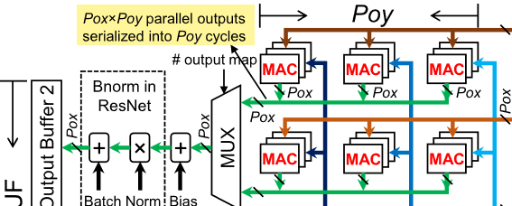

# Serializer

Serialize the output of MAC in order to reduce the number of adders (for bias) and batch normalization computing units.



In the above figure, the output is serialized twice.
The first time is not explicitly depicted, not written in the box, which transform the Poy * Pox width of data into Pox.
The second one is implemented by the MUX.

The above is realizable due to 2 * Poy < Nkx * Nky * Nif.

Actually, if
$$
N*Poy < Nkx*Nky*Nif
$$
Then there can be N serializations.

## IO

```verilog
module Serializer #(
    parameter Pox = 3,
    parameter Poy = 3,
    parameter MUX_Channel = 2
) (
    input clk,
    input rst,
    input [Poy-1:0][Pox-1:0][15:0] mac_output,
    input mac_output_valid,
    output reg [15:0] serializer_out,
    output reg serializer_out_valid
);
```
